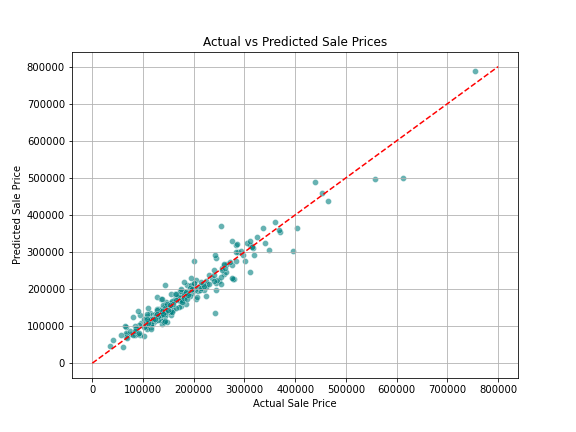
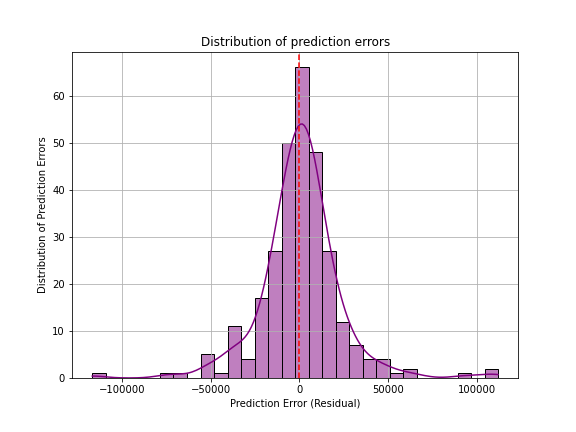

# 🏡 House Price Prediction - Data Science Project

This is a supervised machine learning project using regression to predict house prices based on various features. The dataset is from a Kaggle competition: [House Prices - Advanced Regression Techniques](https://www.kaggle.com/c/house-prices-advanced-regression-techniques).

---

##  Project Overview

-  Performed **exploratory data analysis** and cleaned the dataset
-  Handled missing values and dropped unhelpful features
-  Applied **feature encoding** using dummy variables
-  Built a **Linear Regression model**
-  Applied **log transformation** to reduce skew and improve predictions
-  Visualized model performance with prediction plots

---

##  Dataset Files

- `train.csv`: Training data (features + SalePrice)
- `test.csv`: Test data (used for submission)
- `data_description.txt`: Field descriptions
- `sample_submission.csv`: Submission format

---

##  Key Steps

### 1. Data Cleaning
- Dropped columns with excessive missing values: `'PoolQC', 'MiscFeature', 'Alley', 'Fence', 'FireplaceQu'`
- Imputed remaining missing values with mode or most common value

### 2. Feature Engineering
- Categorical features were one-hot encoded
- Final feature matrix shape: `X.shape = (1460, 279)`

### 3. Target Transformation
- Applied `np.log1p()` on `SalePrice` to handle right-skewness
- Improved model accuracy and reduced prediction error

### 4. Model Used
- **Linear Regression** from `scikit-learn`
- RMSE (after log transform): **₹22,935**
- R² Score (after log transform): **0.93**

---

##  Visualizations

###  Actual vs Predicted Plot

This scatter plot shows how close our predictions are to the actual sale prices:

###  Residual Plot

This shows how well-distributed our prediction errors are:

---

##  Libraries Used

- `pandas`
- `numpy`
- `matplotlib`
- `seaborn`
- `scikit-learn`

---

##  Future Improvements (To Be Explored)

- Try other models like **Random Forest Regressor** or **XGBoost**
- Perform **more detailed feature selection** and handle potential outliers
- Use **cross-validation** to validate model performance more robustly
---

##  Project Status

✔️ Completed first version  
🚀 Pushed to GitHub  
📁 Ready to showcase in resume or portfolio!

---

##  Author

**Rujuta Dani**  
[GitHub Profile](https://github.com/rujuta-dani)

---

